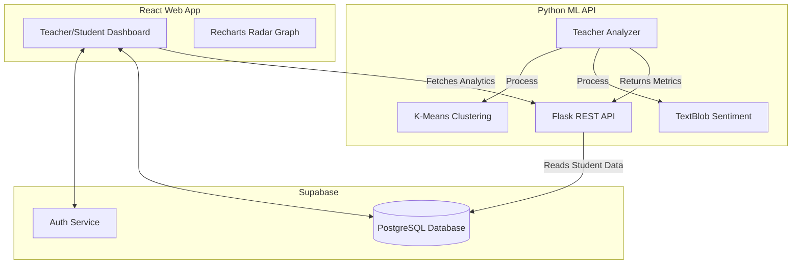

# Teacher Behavior Analytics System

    

A sophisticated, full-stack platform designed to help educators improve their teaching methods through data-driven behavioral insights. By integrating **Machine Learning** with real-time student feedback and quiz performance, the system provides a holistic view of classroom dynamics.

---

## 🌟 Vision

The goal of this project is to bridge the gap between qualitative student feedback and quantitative academic performance. By leveraging **Natural Language Processing (NLP)** and **Clustering algorithms**, we transform raw classroom data into actionable suggestions, helping teachers transition from "Average" to "Excellent" tiers through standardized behavioral metrics.

---

## 🏗️ System Architecture

The project consists of three core layers: a responsive **React** dashboard, a **Supabase** backend for persistence, and a **Python Flask API** that serves as the "Intelligence Engine."



---

## 🧠 Machine Learning Engine

The "heart" of the project is the `ml/` directory, which computes teacher profiles across **6 Behavioral Dimensions**:

### 1. The 6 Dimensions
- **Student Satisfaction**: Derived from quantitative ratings in classroom feedback.
- **Teaching Effectiveness**: Based on average quiz scores and pass rates across all classroom quizzes.
- **Student Engagement**: Calculated as the ratio of feedback submissions to student enrollments.
- **Content Coverage**: A comparative metric looking at the volume of quizzes and assessments created.
- **Comment Sentiment**: Uses **NLP (TextBlob)** to analyze qualitative free-text feedback from students, detecting frustration or satisfaction.
- **Consistency**: Measures the variance of feedback scores across different classrooms to ensure a uniform teaching experience.

### 2. Normalization & Scoring
All raw metrics are normalized using `MinMaxScaler` into a standard **0-100 score**. This allows for a fair comparison across different dimensions and peer-to-peer benchmarking.

### 3. Clustering & Tiering
The system uses **K-Means Clustering** to categorize teachers into four distinct tiers:
- 🌈 **Excellent**: High satisfaction and effectiveness.
- ✨ **Good**: Strong performance with room for minor refinement.
- 📈 **Average**: Meeting base requirements but lacking engagement or consistency.
- ⚠️ **Needs Improvement**: Action required on multiple behavioral dimensions.

---

## ✨ Features

### 👨‍🏫 For Teachers
- **Classroom Management**: Create and manage multiple virtual classrooms with unique invite codes.
- **Interactive Quizzes**: Build sophisticated multiple-choice quizzes with time limits.
- **Feedback Loops**: Define custom questions for students to answer periodically.
- **AI Analytics**: A **Radar (Spider) Chart** powered by Recharts that visualizes behavioral dimensions.
- **Actionable Suggestions**: Specific, AI-generated tips (e.g., "Student Satisfaction is low. Try reviewing core concepts before quizzes.")

### 🎓 For Students
- **Simple Enrollment**: Join classrooms using a 6-digit code.
- **Assessment Center**: Take quizzes and view scores immediately.
- **Voice Your Opinion**: Submit qualitative and quantitative feedback to teachers anonymously.

---

## 🛠️ Tech Stack

### Frontend
- **React 18** + **Vite**
- **TypeScript** for type safety
- **Tailwind CSS** + **Shadcn UI** for modern aesthetics
- **Recharts** for complex data visualization
- **Lucide React** for iconography

### Machine Learning & Backend
- **Python 3.10+** (Flask)
- **Scikit-learn** (K-Means, Normalization)
- **TextBlob** (Sentiment Analysis)
- **Pandas/NumPy** (Data Wrangling)
- **Supabase** (PostgreSQL, Auth, Real-time)

---

## 🚀 Getting Started

### Prerequisites
- Node.js (v18+)
- Python (v3.10+)
- A Supabase Project (URL & Anon Key)

### 1. Clone the repository
```bash
git clone https://github.com/HARS23/Teacher-analytics-project.git
cd Teacher-analytics-project
```

### 2. Frontend Setup
```bash
cd app
npm install
```
Create a `.env` file in the `app/` directory:
```env
VITE_SUPABASE_URL=your_supabase_url
VITE_SUPABASE_ANON_KEY=your_supabase_anon_key
VITE_ML_API_URL=http://localhost:5001/api/analyze
```
Start the frontend:
```bash
npm run dev
```

### 3. ML Backend Setup
```bash
cd ml
python -m venv venv
source venv/bin/activate # or venv\Scripts\activate on Windows
pip install -r requirements.txt
```
The ML engine uses the same Supabase credentials. Ensure your environment has `VITE_SUPABASE_URL` and `VITE_SUPABASE_ANON_KEY` available (the Flask app automatically looks into the `app/.env` file).

Start the ML API:
```bash
python api.py
```
*The API will run on `http://localhost:5001` by default.*

---

## 📄 License

This project is currently unlicensed.

## 👨‍💻 Author

**HARS23**
- GitHub: [@HARS23](https://github.com/HARS23)

---

Give a ⭐️ if this project helped you!